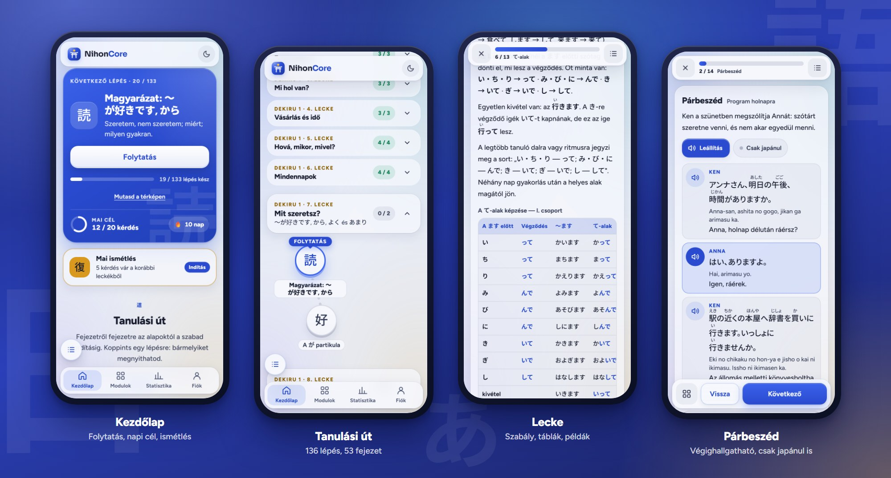
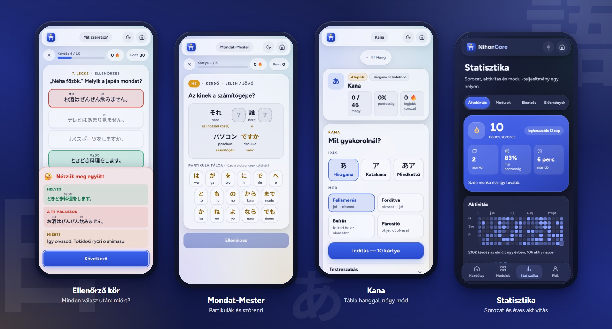
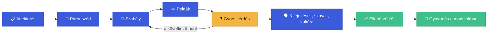
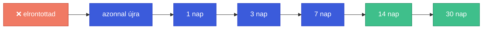

<div align="center">



<br /><br />

<a href="https://nokedli25ttv.github.io/NihonCore/"></a>

<br /><br />


</div>

<br />

## 🎌 Mi ez?

A **NihonCore** egy magyar nyelvű japántanuló webapp. Nem szókártya-gyűjtemény: a **nyelvtant** tanítja,
lépésről lépésre — előbb megérted a szabályt, aztán gyakorlod, végül időzített ismétléssel rögzíted.

A tananyag egy **vezetett tanulási út**: a legelső kanától a tiszteleti nyelvig, a *Dekiru 1* és
*Dekiru 2* tankönyv leckéinek sorrendjében. Minden leckéhez részletes magyarázat, párbeszéd, példamondatok,
gyors kérdések és gyakorló feladatok tartoznak.

Telefonra készült, de tableten és gépen is otthon van; telepíthető, és bejelentkezés nélkül is teljes.

<br />

<div align="center">

</div>

<br />

## 📸 Így néz ki

<div align="center">

<br /><br />

</div>

<br />

## ✨ Mit tud?

### 🗺️ Tanulási út

- **236 lépés 53 fejezetben**, kanyargó térképen: mindig látod, hol tartasz, és mi jön.
- Minden lecke után **a lecke saját mintái és mondatai** jönnek gyakorlásnak.
- Négy leckénként **kis teszt** (30 perc), tizenkét leckénként **nagy dolgozat** (60 perc): nem kötelező, időre is megírható, és minden kitöltés elmentődik.
- Első indításkor megkérdezi, **honnan indulsz**: nulláról, vagy már olvasod a kanát.
- A kezdőlap **„Folytatás"** gombja mindig a következő lépésre visz.
- Egy lépés akkor kész, ha egy teljes kört legalább **60%**-ra megcsinálsz.
- A hosszú térképen csak az aktuális fejezetek nyitottak; oldalt **tartalomjegyzék** segít ugrani.

### 📖 Leckék

Minden lecke **lapozható**, mint egy jó tankönyv, csak nem kell görgetni:



- **Részletes magyarázat** minden nyelvtani ponthoz: minta, szabály, táblázatok, „Jó tudni", „Gyakori hiba".
- **Párbeszéd** minden leckében: végighallgatható, és átváltható „csak japánul" nézetre.
- **Minden példamondat meghallgatható**, furiganával, átírással és fordítással (ezek ki is kapcsolhatók).
- **Gyors kérdés** minden pont után, a lecke végén **10 kérdéses ellenőrző kör** és **hallás utáni kör**.
- Minden válasz után megmutatja, **miért** az a helyes.
- **„Hibáim újra"**: amit elrontottál, rögtön átveheted még egyszer.

### 🔁 Ismétlés, ami nem hagyja elfelejteni

A leckék kérdései **időzítve térnek vissza**: amit tudsz, egyre ritkábban; amit elrontasz, azonnal.



A kezdőlapon a **„Mai ismétlés"** kártya szól, ha van esedékes kérdés. Mellette **napi cél** és **sorozat** 🔥.

### 🧩 Gyakorló modulok

| | Modul | Mit gyakorolsz | Készlet |
|---|---|---|---|
| あ | **Kana** | hiragana és katakana: felismerés, fordítva, beírás, párosító; tábla hanggal | 104 jel írásonként |
| 文 | **Mondat-Mester** | partikula-kitöltő és mondat-puzzle | 627 mondat, 16 partikula |
| 活 | **Ragozó** | 12 igealak a ます-tól a műveltető-szenvedőig: felismerés, építés, beírás | 168 ige |
| 形 | **Melléknév** | い és な melléknevek 9 alakja | 149 melléknév |
| 数 | **Számláló szavak** | つ・本・枚・冊… a hangváltozásokkal együtt | 12 számláló, 102 tárgy |
| 時 | **Dátum & Idő** | hónapok, napok, órák, percek, évek, relatív idő | 227 elem |
| 聞 | **Hallás & Kiejtés** | felismerés, diktálás, mondatok; hosszú hang és kis っ csapdák | 134 hang-lecke, 566 mondat |
| 型 | **Nyelvtani minták** | felismerés, kiegészítés, fordítás: leckénként a lecke mintái | 283 minta, 566 példa |
| 訳 | **Szabad fordítás** | magyarról japánra, szabadon beírva, ötfokú értékeléssel | a mondatkészletből |
| 有 | **Alap igék** | a ます-alak négy formája: létezés, mozgás, fogyasztás | — |

A modulok okosan javítanak: nem csak annyit mondanak, hogy „rossz", hanem **megmutatják, hol csúszott el**
(rossz tő, rossz végződés, kimaradt kis っ…), és a gyengébb részeket gyakrabban hozzák.

> A modulok készletei még bővülnek: a nagy feltöltés a fejlesztés utolsó lépése.

### 📊 Statisztika

- **Sorozat**, mai körök, pontosság és idő.
- **Éves aktivitás-naptár** (mint a GitHubé).
- Modulonkénti teljesítmény, **vakfoltok** és célzott ajánlat: mit gyakorolj most.
- Minden kör előzménye, a félbehagyottak is.

### 📱 Kényelmi dolgok

- **Telepíthető** (PWA), és internet nélkül is megnyílik.
- **Világos és sötét téma.**
- **Fiók nem kell.** Ha belépsz (e-mail vagy Google), a haladásod **szinkronizál** az eszközeid között.
- Billentyűzettel is végigjátszható: `1`–`4` válasz, `Enter` tovább, `←` `→` lapozás.

<br />

## 🔢 Számokban

| Leckék | | Gyakorlás | |
|---|---:|---|---:|
| Lecke | **57** | Lépés a tanulási úton | **236** |
| Nyelvtani pont | **402** | Fejezet | **53** |
| Példamondat (hanggal) | **2390** | Gyakorló modul | **10** |
| Saját kérdés | **1142** | Mondat a Mondat-Mesterben | **627** |
| Párbeszéd-sor | **699** | Ige a Ragozóban | **168** |
| Kész kifejezés | **547** | Melléknév | **149** |
| Szó-kártya | **1484** | Dátum- és idő-elem | **227** |
| Táblázat | **321** | Hang-lecke | **134** |
| „Gyakori hiba" | **344** | Kana-jel | **208** |
| Kulturális tudnivaló | **197** | Nyelvtani minta | **283** |
| | | Dolgozat | **12** |

A leckék megoszlása: 1 előkészítő (írás és kiejtés) · 24 a *Dekiru 1* nyomán · 24 a *Dekiru 2* nyomán ·
8 kiegészítő (JLPT N5 és N4).

<br />

## 🛠️ Hogyan készült?

Szándékosan egyszerű: **sima HTML, CSS és JavaScript** — keretrendszer és build nélkül. Amit a böngésző megnyit,
az maga a forráskód.

```
NihonCore/
├── index.html            kezdőlap: Folytatás, napi cél, ismétlés, tanulási út
├── pages/                lecke, modulok, statisztika, belépés
├── css/style.css         a teljes stíluslap (indigó paletta, üveges felületek, sötét téma)
├── js/
│   ├── app.js            minden logika: közös részek + oldalanként egy init
│   ├── auth.js · sync.js Firebase belépés és szinkron (nem kötelező)
│   └── data/             a tartalom: leckék, mondatok, igék, szabályok
├── sw.js                 Service Worker (offline)
└── img/
```

| | |
|---|---|
| **Felület** | saját stíluslap tokenekkel, [Figtree](https://fonts.google.com/specimen/Figtree) + [Noto Sans JP](https://fonts.google.com/noto/specimen/Noto+Sans+JP), [anime.js](https://animejs.com/) a mikro-animációkhoz |
| **Hang** | gépi felolvasás; ha nem érhető el, a böngésző beépített japán hangja |
| **Tárolás** | a böngészőben (localStorage); belépve Firestore-szinkron |
| **Élesítés** | GitHub Pages, közvetlenül a `main` ágról |

### Kipróbálás a saját gépeden

Nincs mit telepíteni:

```bash
git clone https://github.com/Nokedli25TTV/NihonCore.git
```

Utána nyisd meg az `index.html`-t a böngészőben. (A belépés, a szinkron és az offline mód csak webről,
`https://` címről megnyitva működik — a tanulás e nélkül is megy.)

<br />

## 📚 A tartalomról

- A tanulási út **a *Dekiru 1* és *Dekiru 2* tankönyv leckéinek témáit és sorrendjét követi**, így a
  könyv mellé is jól használható.
- **A magyarázatok és a példamondatok saját megfogalmazások** — a könyvek szövege nem szerepel az appban.
- A szókincset és a kanjit az app nem tanítja külön: a leckékben csak a megértéshez kellő szavak vannak.
- A japán mondatokat **anyanyelvi lektor még nem nézte át**. Ha hibát találsz, kérlek, jelezd egy
  [issue-ban](https://github.com/Nokedli25TTV/NihonCore/issues).

<br />

## 🧭 Hol tart?

- [x] Tanulási út a kanától a 48. leckéig, térképpel és tartalomjegyzékkel
- [x] 57 részletes lecke lapozós menettel, párbeszéddel, gyors kérdésekkel
- [x] Időzített ismétlés, napi cél, sorozat
- [x] 10 gyakorló modul és statisztika
- [x] Fiók, szinkron, telepíthető app, sötét téma
- [ ] A gyakorló modulok nagy tartalom-feltöltése
- [ ] Anyanyelvi lektorálás

<br />

<div align="center">

**がんばってください！**

<sub>Készítette: <a href="https://github.com/Nokedli25TTV">Nokedli25TTV</a> · magyar tanulóknak, szeretettel</sub>

</div>
